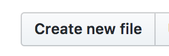
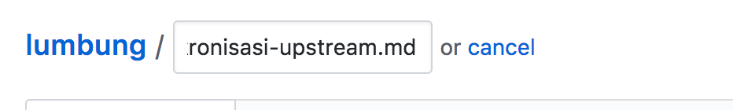
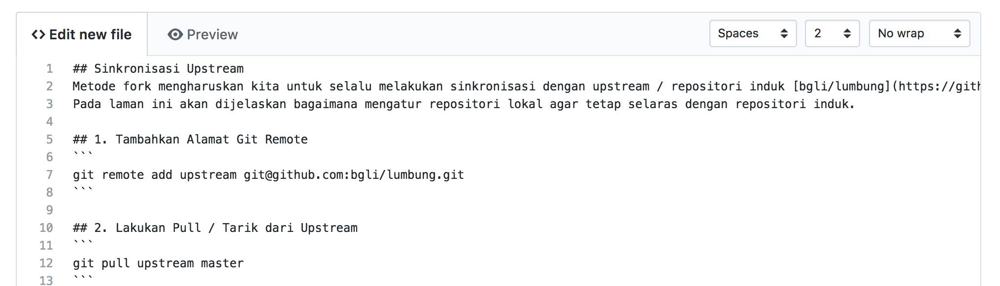
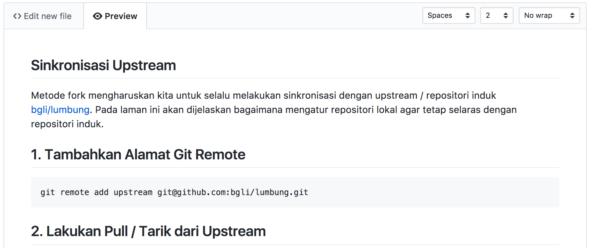
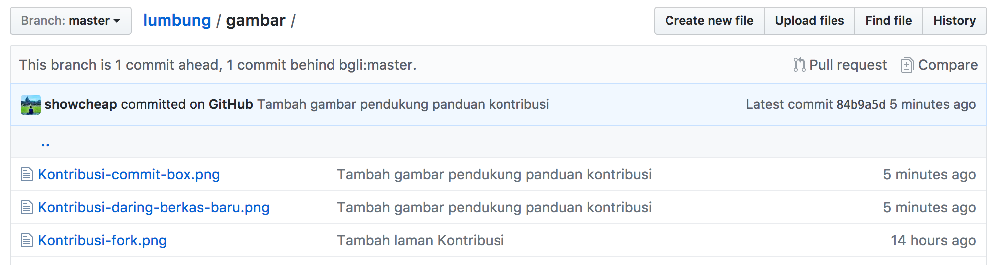
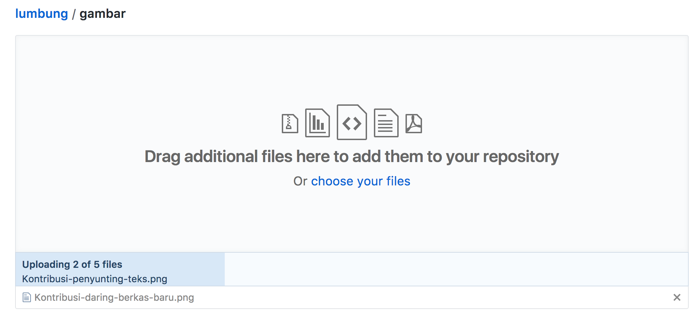
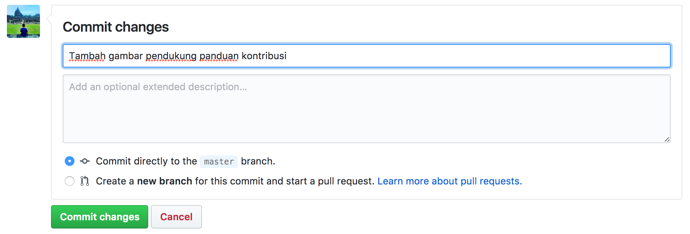

## Markdown Editor Online (GitHub)
Selain dengan cara melakukan clone ke komputer, ada cara lain untuk ikut berkontribusi. Yakni menggunakan editor online yang telah disediakan oleh Github.

Beberapa kelebihan menggunakan Editor Online:
* Tidak perlu menginstall Git di komputer
* Tersedia Preview untuk meminimalisir kesalahan format markdown
* Cukup menggunakan Browser tanpa tambahan `software` tambahan

Untuk memulai kontribusi, silahkan mengikuti panduan dibawah ini.

## Buat berkas baru
> **Catatan:** Sebelum membuat berkas baru, pastikan kamu sudah membaca [Panduan Kontribusi](Kontribusi.md)

1. Buka repositori hasil fork kamu di Github, lalu klik tombol **Create New File**

2. Pada kolom nama file berikan nama dengan akhiran file ekstensi `.md` (Markdown)

3. Tulis konten di penyunting teks yang tersedia

4. Buka tab *Preview* untuk melihat pratinjau

## Unggah Gambar
Untuk menambahkan gambar pendukung, gunakan fitur unggah gambar.

1. Klik folder gambar pada halaman utama repositori di github

2. Klik tombol **Upload Files**
3. Seret dan Lepas (_Drag and Drop_) berkas yang akan diunggah 

4. Masukkan pesan commit pada kotak yang tersedia

5. Klik *Commit Changes*

